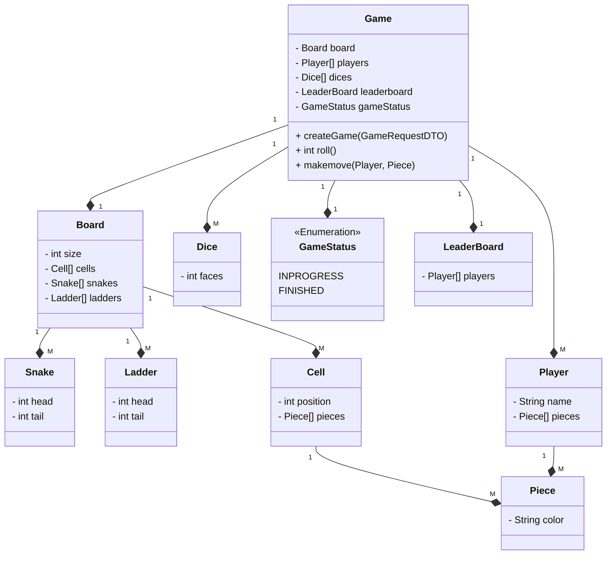
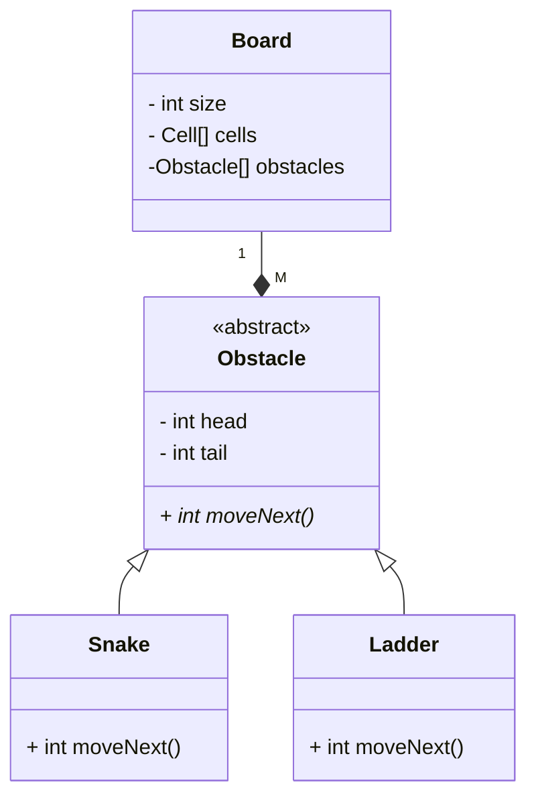
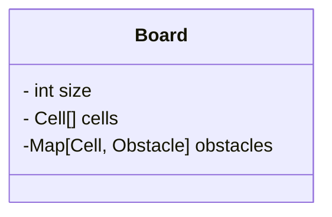
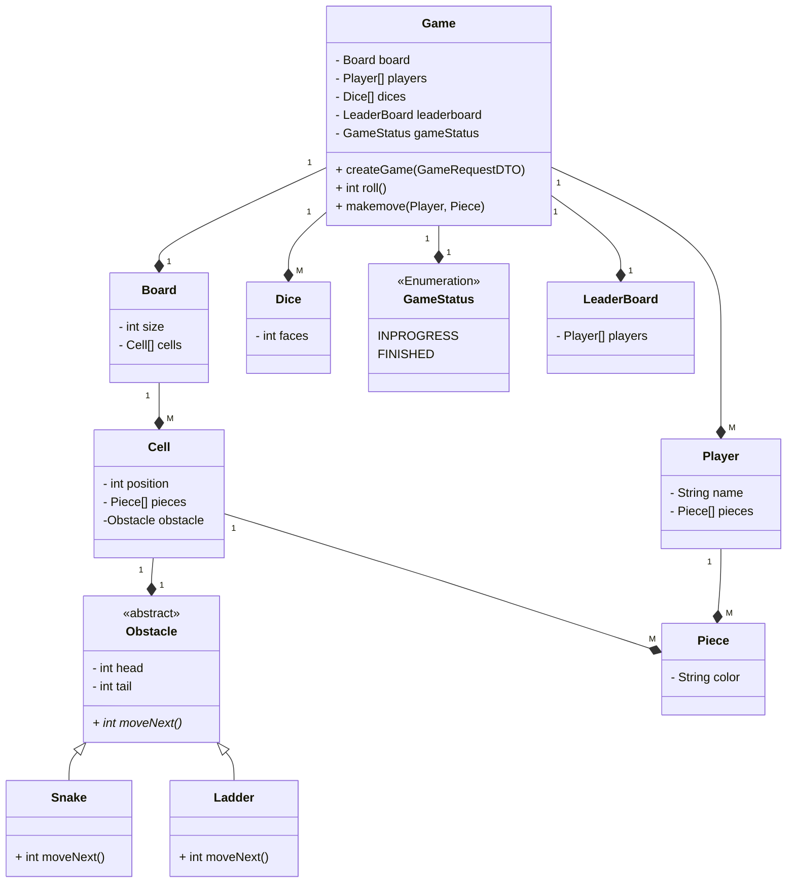
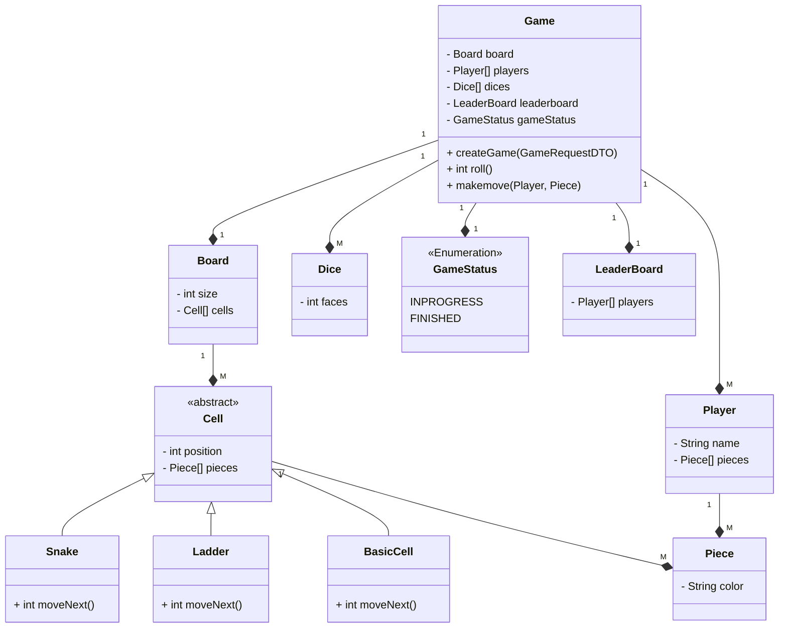
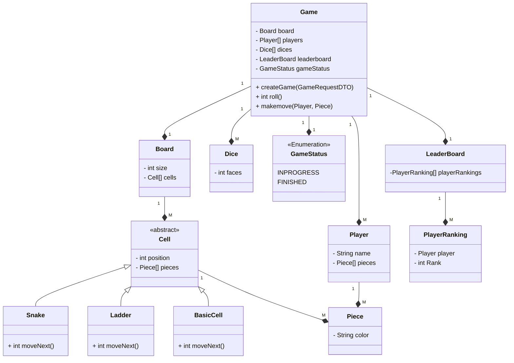

# SNAKES AND LADDERS

## Requirements

### Entities

1. Game
2. Board
3. Players
4. LeaderBoard
5. GameStatus

- In the above design the Snake and Ladder class have duplicate fields
- And also tomorrow there might similar foreign classes like Frog might be added, this shows OCP violation in Board class and SRP violation.

- So we make abstract class

- By adding moveNext() function we can extend class, which doesnot depend on tail and head pattern, so it will implement movenext function.

- However If we wanna know if cell contains the Obstacle, we need to search all List of obstacles and find, which is not optimised, so we can make use of Hashmap

- Or else we can move obstacles to Cell class.

- But here Obstacle would be null for basecell, so it adds lot of null checks, so to reduce that we make cell an abstract class

- But here in the LeaderBoard, the info is not proper, it is showing the player rank.

